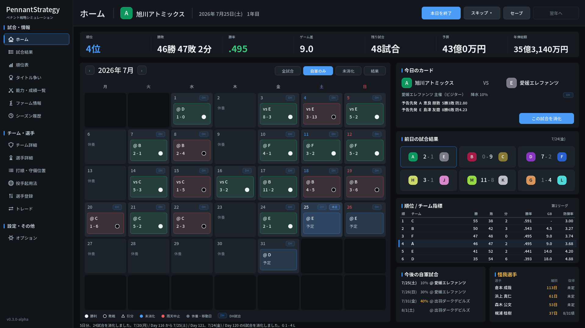
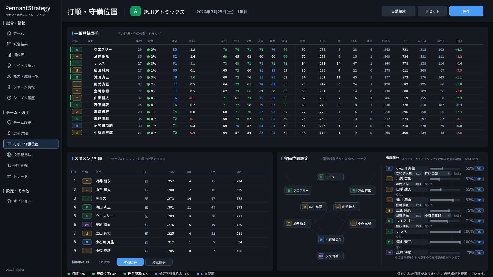
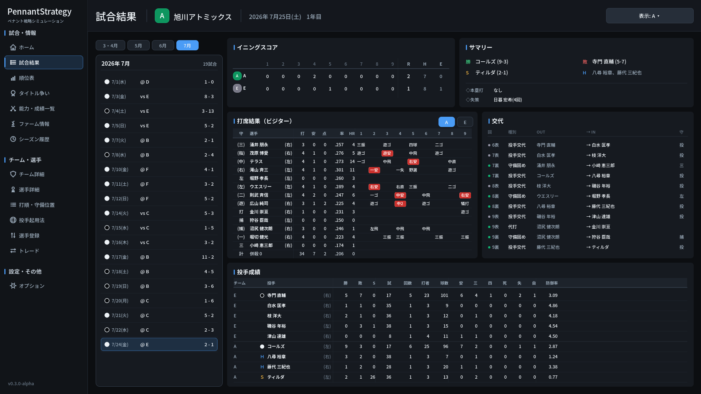
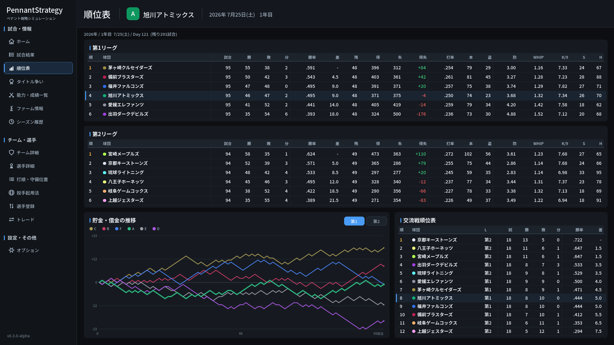

# PennantStrategy

**12球団・143試合のペナントレースを、GMとして指揮する野球運営シミュレーション。**

Windows向けに、**無料**で公開しています。

**[→ 最新版をダウンロード](https://github.com/Hoki0Niwa/Pennant-Strategy/releases)**
Windows 64bit / インストール不要 / 広告なし・アカウント登録なし

## 概要

12球団から1つを選び、GMとしてチームを黄金時代へ導こう。

- 試合のルールからオフシーズンまで、NPBのシステムを再現。
- 年数制限はなし。気が済むまでシーズンを回せる。
- 各種セイバーメトリクスの指標に対応。
- 過去のシーズンの記録も遡って閲覧可能。
- わかりやすく、直感的に操作できるUI。
- オプションでDHの有無やドラフトシステムも変更可能。

## 特徴

### 進行速度を自分で選べる

1日ずつ進めて都度起用を入れ替えても良し、シーズン終了まで一気に進めるも良し。
じっくり見る年と、オフシーズンまで飛ばす年を使い分けられます。

### セイバーメトリクス

- **WAR** はFanGraphs型fWARに準拠(打撃wRAA・守備OAA・投手FIP系、リーグ補正と代替水準つき)
- **守備評価** としてUZR・OAAを実装。失策数だけでは分からない選手の守備パフォーマンスを可視化。
- **打球** はStatcast準拠の打球速度・打球角度の分布を元に決定

必要不可欠な指標は一通り揃えてあります。

### 現実通りの補強手段

ドラフト(入札・抽選つき)、FA(A/B/Cランク・金銭補償・複数年契約)、
外国人スカウト(能力非公開の条件指定方式)、シーズン中トレード、現役ドラフト、
戦力外と再獲得、育成契約、キャンプでの特別練習。

ただし、予算上限によりすべてはできません。取捨選択が大事になってきます。

### 自分好みの起用設定

打順・守備位置・先発ローテ・リリーフ起用をドラッグ&ドロップで組めます。
CPUに任せて結果だけ追いかける遊び方もできます。

### MODで中身を差し替えられる

初期選手・チーム・日程・名前プール・シミュレーション係数を、外部データで差し替えられます。
収録されている球団名・選手名はすべて架空のものです。

## 画面

|  |  |
|---|---|
| 打順・守備位置をドラッグ&ドロップで設定 | 打席ごとのログと継投の記録が残る試合結果 |

主要な画面は以下の通りです。

| 画面 | 役割 |
|---|---|
| ホーム | 本日の試合、直近成績、今後の日程、怪我人、各種スキップ操作 |
| 試合結果 | 回別得点、勝敗投手、セーブ/ホールド、打席ごとのログ、交代表 |
| 順位表 / ランキング | リーグ順位とゲーム差、優勝マジック、個人成績ランキング、タイトル争い |
| 能力・成績一覧 | 全選手の能力値・成績・高度な指標を横断表示。守備位置や役割で絞り込み、列ソート |
| シーズン履歴 | 過去年の順位と表彰、歴代記録、タイトル履歴 |
| チーム詳細 | 自軍・他球団のロスターとポジション別戦力 |
| 一軍入替 | 31人枠、外国人枠、育成選手の支配下登録 |
| 打順・守備位置 / 投手起用法 | スタメンと控え、先発ローテ、リリーフの役割(ロング/中継ぎ/セット/抑え) |
| 選手詳細 | 能力、成績、今季試合履歴、月間成績、年俸、契約、経歴 |
| トレード | 自軍からの提案、CPUからの提案への回答、成立トレード一覧 |
| オフシーズン | FA宣言、引退、戦力外、ドラフト、戦力外獲得、現役ドラフト、契約更改、FA、契約年数、外国人、キャンプ、能力変化 |
| ポストシーズン / 表彰 | CS・日本シリーズ、MVP・新人王・各部門タイトル・ベストナイン・ゴールデングラブ |

## アルファ版について

現在のバージョンは **v0.1.0-alpha** です。
1シーズンから10年以上の長期プレイまで通して動作することは確認していますが、開発中なので想定しない挙動が発生する可能性があります。

- 数値バランスは調整途中です。
- セーブデータの形式は今後変わる可能性があります。**大事なデータはバックアップを取ってください。**
- 二軍のシミュレーションと、試合のライブ観戦UIは未実装です。

## これから実装したいもの

- 試合のライブ観戦UI
- 二軍のシミュレーション
- 球団収入モデル(観客動員・成績連動)
- FAの人的補償・架空設定としてドラフト権譲渡の追加
- トレードの拡張(オフシーズントレード、複数対1のパッケージ)、人的補償
- 詳細なFA交渉画面
- 監督就任、監督能力、采配傾向
- 選手のメジャー挑戦
- さらなる指標の追加
- シミュレーション世界で起こったことをニュース記事風にまとめる機能
- 選手を深く掘り下げる記事
- シミュレーションのさらなる高速化
- and more...

## MOD

現状はルール係数、初期選手・チームデータ、日程、名前プールを外部データで差し替えられます。
GPLv3の条件に従う範囲で、派生版やMODの作成・公開を歓迎します。

## フィードバック

おかしいと思った箇所は [Issues](https://github.com/Hoki0Niwa/Pennant-Strategy/issues) に報告してください。以下はその一例です。

- クラッシュやセーブデータ破損
- 長期プレイでの順位、表彰、成績集計の異常
- 一軍編成やドラフト、戦力外などにおけるAI判断について
- 試合・各種能力のバランスについて
- その他追加してほしい機能など

## 開発者向け

- `test/`: GdUnit4の自動テスト(`tools\run_tests.cmd` で実行)
- `tools/`: headless実行用の調査・レポートツール(バランスレポート、長期オートプレイ、PAベンチマーク、球数分布、守備価値較正など)
- 開発ツールを有効にすると、サイドバーに「バランスレポート」「選手プローブ」「ドラフト検証」が表示されます

## ライセンス

GNU General Public License v3.0 で公開しています。詳しくは [LICENSE](LICENSE) を参照してください。
配布する場合は、GPLv3に従ってソースコードも公開してください。

Windows配布物には、GPLv3本文と同梱コンポーネントのライセンスを `build/windows/LICENSES/` に収録しています。
第三者コンポーネントの一覧は `build/windows/THIRD_PARTY_NOTICES.txt` を参照してください。

- `assets/fonts/NotoSansJP.ttf`: SIL Open Font License 1.1
- `addons/godot-sqlite`: MIT License

## English

PennantStrategy is a Japanese-language baseball front-office simulation for Windows, built with Godot.
You manage a 12-team league over a 143-game season and across decades: drafts, free agency, trades,
injuries, aging and rebuilds. WAR follows the FanGraphs fWAR framework, fielding uses zero-centered
UZR/OAA, and batted balls are modeled on Statcast exit-velocity and launch-angle distributions,
with league rates calibrated against real NPB results.

Free, open source (GPLv3), and mod-friendly. All teams and players are fictional.
The interface is currently Japanese only.
